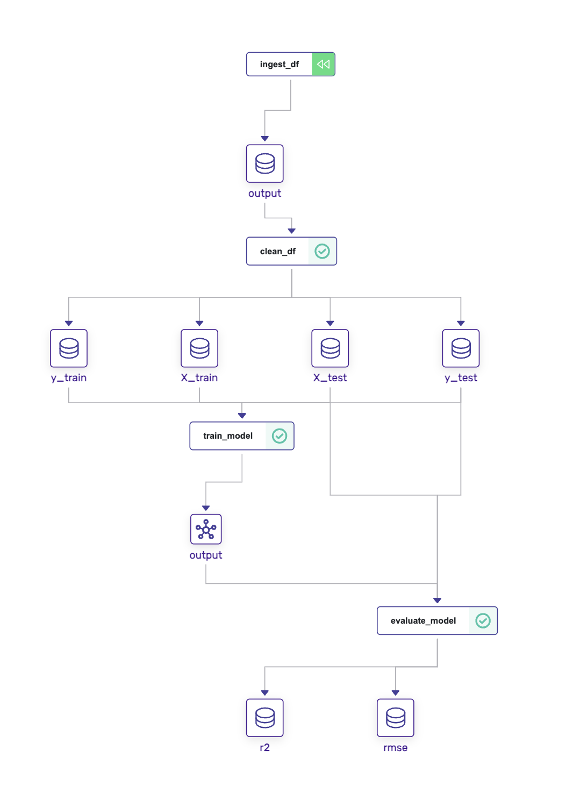
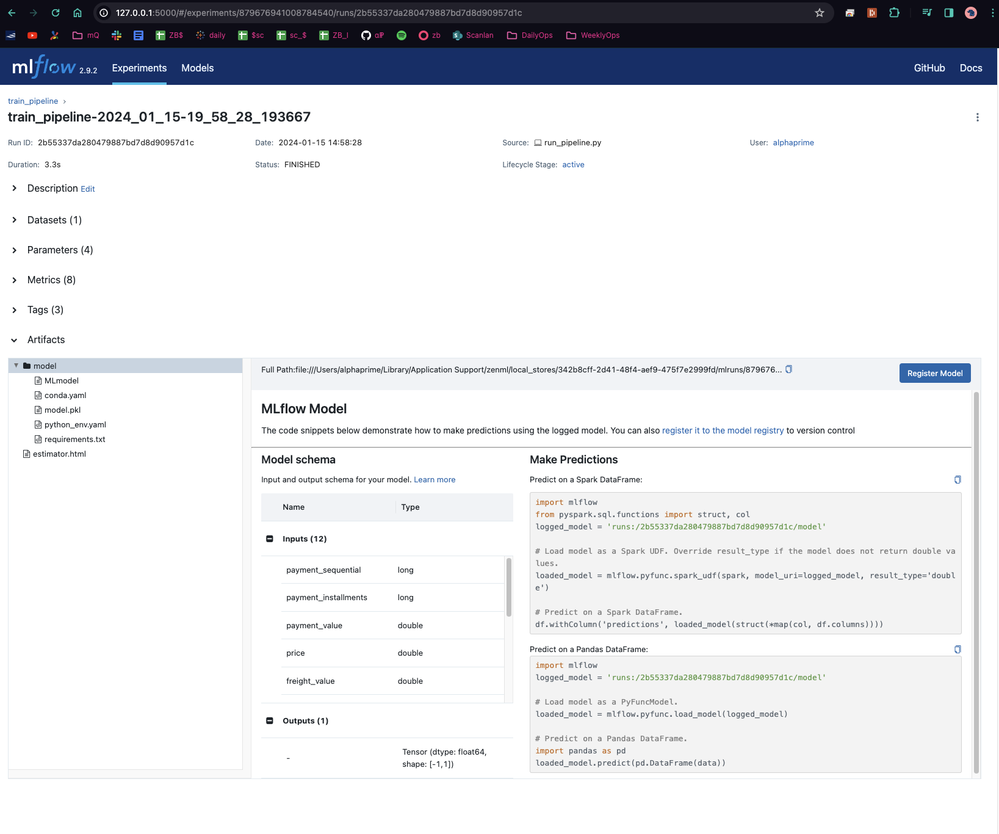

# Machine Learning OPS Project

* ### [ML - Learning Tree Link](https://whimsical.com/machine-learning-roadmap-by-ayush-singh-newera-J1EwnqAPUtF77ejgbRc8Hk)

- **[ZenML Docs](https://docs.zenml.io/getting-started/installation)**
- [MLFlow Docs](https://www.mlflow.org/docs/latest/index.html)

### Log 

- 010724 ran into some issues with getting the dependencies downloaded and my envirornment (conda) correct. The error ended up being that I had python 3.12, which some of the versions of the dependencies did not support. I downgraded to 3.11 per ZenML docs and it seems I have all of the necessary dependencies installed.

- 011524 - got the pipeline running, with all component steps built in. 

```bash
(zenmlops) alphaPrime >> ml-ops $ python run_pipeline.py
Initiating a new run for the pipeline: train_pipeline.
The BaseParameters class to define step parameters is deprecated. Check out our docs https://docs.zenml.io/user-guide/advanced-guide/pipelining-features/configure-steps-pipelines for information on how to parameterize your steps. As a quick fix to get rid of this warning, make sure your parameter class inherits from pydantic.BaseModel instead of the BaseParameters class.
Reusing registered version: (version: 4).
Executing a new run.
Using user: default
Using stack: default
  artifact_store: default
  orchestrator: default
Using cached version of ingest_df.
Linking artifact output to model None version None implicitly.
Step ingest_df has started.
Step clean_df has started.
Step clean_df has finished in 0.855s.
Step train_model has started.
Model training complete!
Step train_model has finished in 0.195s.
Step evaluate_model has started.
Calculating MSE score
MSE score: 1.864077053397548
Calculating R2 score
R2 score: 0.017729030402295565
Calculating RMSE score
RMSE score: 1.3653120717980736
Step evaluate_model has finished in 0.314s.
Run train_pipeline-2024_01_15-19_00_28_224596 has finished in 1.602s.
Dashboard URL: http://127.0.0.1:8237/workspaces/default/pipelines/26e446e3-8301-4589-969a-69233c37143e/runs/79df8ebb-68b1-4458-9f12-2bc84e6b9ded/dag
```


- 011524 - mlflow uri 

```bash
(zenmlops) alphaPrime >> ml-ops $ mlflow ui --backend-store-uri "file:/Users/alphaprime/Library/Application Support/zenml/local_stores/342b8cff-2d41-48f4-aef9-475f7e2999fd/mlruns"
[2024-01-15 20:09:23 -0500] [21094] [INFO] Starting gunicorn 21.2.0
[2024-01-15 20:09:23 -0500] [21094] [INFO] Listening at: http://127.0.0.1:5000 (21094)
[2024-01-15 20:09:23 -0500] [21094] [INFO] Using worker: sync
[2024-01-15 20:09:23 -0500] [21097] [INFO] Booting worker with pid: 21097
[2024-01-15 20:09:23 -0500] [21098] [INFO] Booting worker with pid: 21098
[2024-01-15 20:09:23 -0500] [21099] [INFO] Booting worker with pid: 21099
[2024-01-15 20:09:23 -0500] [21100] [INFO] Booting worker with pid: 21100
```


- 011724 - deployment

2:32:06 video bookmark

deployed the pipeline
```bash
(zenmlops) alphaPrime >> ml-ops $ python run_deployment.py --config deploy
Initiating a new run for the pipeline: continuous_deployment_pipeline.
The BaseParameters class to define step parameters is deprecated. Check out our docs https://docs.zenml.io/user-guide/advanced-guide/pipelining-features/configure-steps-pipelines for information on how to parameterize your steps. As a quick fix to get rid of this warning, make sure your parameter class inherits from pydantic.BaseModel instead of the BaseParameters class.
The BaseParameters class to define step parameters is deprecated. Check out our docs https://docs.zenml.io/user-guide/advanced-guide/pipelining-features/configure-steps-pipelines for information on how to parameterize your steps. As a quick fix to get rid of this warning, make sure your parameter class inherits from pydantic.BaseModel instead of the BaseParameters class.
Reusing registered version: (version: 1).
Executing a new run.
Using user: default
Using stack: mlflow_stack
  experiment_tracker: mlflow_tracker
  artifact_store: default
  orchestrator: default
  model_deployer: mlflow_customer
Using cached version of ingest_df.
Linking artifact output to model None version None implicitly.
Step ingest_df has started.
Using cached version of clean_df.
Step clean_df has started.
Using cached version of train_model.
Linking artifact output to model None version None implicitly.
Step train_model has started.
Using cached version of evaluate_model.
Step evaluate_model has started.
Step deployment_trigger has started.
Step deployment_trigger has finished in 0.051s.
Caching disabled explicitly for mlflow_model_deployer_step.
Step mlflow_model_deployer_step has started.
2024/01/17 06:46:03 WARNING mlflow.tracking.fluent: Cannot retrieve experiment by name continuous_deployment_pipeline
Step mlflow_model_deployer_step has finished in 0.052s.
Run continuous_deployment_pipeline-2024_01_17-11_46_02_931065 has finished in 0.569s.
Dashboard URL: http://127.0.0.1:8237/workspaces/default/pipelines/33dae6b7-9045-402a-9f6c-6d8f4d5d954c/runs/26409b09-c463-4c7d-9389-b09bd7a5102c/dag
You can run:
    mlflow ui --backend-store-uri file:/Users/alphaprime/Library/Application 
Support/zenml/local_stores/342b8cff-2d41-48f4-aef9-475f7e2999fd/mlruns
to inspect your experiment runs within the MLFlow UI.
.```

#### ZENML:

Starting with ZenML 0.20.0, ZenML comes bundled with a React-based dashboard. This dashboard allows you
to observe your stacks, stack components and pipeline DAGs in a dashboard interface. To access this, you need to [launch the ZenML Server and Dashboard locally](https://docs.zenml.io/user-guide/starter-guide#explore-the-dashboard), but first you must install the optional dependencies for the ZenML server:

```bash
pip install zenml["server"]
zenml up
```

If you are running the `run_deployment.py` script, you will also need to install some integrations using ZenML:

```bash
zenml integration install mlflow -y
```

The project can only be executed with a ZenML stack that has an MLflow experiment tracker and model deployer as a component. Configuring a new stack with the two components are as follows:

```bash
zenml integration install mlflow -y
zenml experiment-tracker register mlflow_tracker --flavor=mlflow
zenml model-deployer register mlflow_customer --flavor=mlflow
zenml stack register mlflow_stack -a default -o default -d mlflow_customer -e mlflow_tracker_customer --set
```

#### Learning Notes:

##### DESIGN PATTERNS:

Design patterns are reusable solutions to common problems that occur in software design. They represent best practices and can speed up the development process by providing tested, proven development paradigms. Here are some common design patterns used in object-oriented programming:

Singleton Pattern: Ensures a class has only one instance and provides a global point of access to it. This is useful when exactly one object is needed to coordinate actions across the system.

Factory Pattern: Provides an interface for creating objects in a superclass, but allows subclasses to alter the type of objects that will be created.

Abstract Factory Pattern: Provides a way to encapsulate a group of individual factories that have a common theme without specifying their concrete classes.

Builder Pattern: Separates the construction of a complex object from its representation so that the same construction process can create different representations.

Prototype Pattern: Used when the type of objects to create is determined by a prototypical instance, which is cloned to produce new objects.

Adapter Pattern: Allows the interface of an existing class to be used as another interface. It is often used to make existing classes work with others without modifying their source code.

Decorator Pattern: Allows behavior to be added to an individual object, either statically or dynamically, without affecting the behavior of other objects from the same class.

Facade Pattern: Provides a simplified interface to a larger body of code, such as a class library.

Observer Pattern: Defines a one-to-many dependency between objects so that when one object changes state, all its dependents are notified and updated automatically.

Strategy Pattern: Enables a strategy (algorithm) to be selected at runtime. The strategy pattern is used to create an interchangeable family of algorithms from which the required process is chosen at run-time.

Your code is using the Strategy Pattern with the DataStrategy abstract base class and its subclasses DataCleaningStrategy and DataSplitStrategy. This allows the DataCleaning class to use different data handling strategies without changing its own implementation.

##### ABSTRACT CLASSES:

_me_: please explaing to me what the init fucntion does in the DataCleaning class. is that simply the logic to instatiate an instace of the class? and then it maps the attributes of self (or the object) to the data construct represented by the class?

_copilot_: Yes, you're correct. The __init__ method in Python is what's known as a constructor. It's a special method that gets called when you create a new instance of a class.

In the DataCleaning class:

The __init__ method takes three arguments:

self: This is a reference to the instance of the class. It's automatically passed in by Python, and it's how you can access instance attributes and other methods from within the class.

df: This is a pandas DataFrame that you're passing in when you create a new instance of DataCleaning. It's stored in the instance attribute self.df, so you can use it in other methods of the class.

strategy: This is an instance of a class that inherits from DataStrategy. It's stored in the instance attribute self.data_strategy, and it's used in the handle_data method to perform some operation on self.df.

So when you create a new instance of DataCleaning, you'd do something like this:

This would create a new DataCleaning object, with my_dataframe stored in self.df and my_strategy stored in self.data_strategy.

Abstract classes in Python are classes that are meant to be inherited from, but not instantiated directly. They're used to define a common interface for its subclasses. This is beneficial when you have a group of related classes that should all implement the same methods, but the implementation of those methods might differ between classes.

In your code, DataStrategy could be an abstract class. It defines a method handle_data that all subclasses should implement. This ensures that no matter what specific strategy you're using (like DataCleaningStrategy or DataSplitStrategy), you can always call handle_data on it.

Here's a simplified example:

```
from abc import ABC, abstractmethod

class DataStrategy(ABC):
    @abstractmethod
    def handle_data(self, df):
        pass

class DataCleaningStrategy(DataStrategy):
    def handle_data(self, df):
        # Implement data cleaning here
        pass

class DataSplitStrategy(DataStrategy):
    def handle_data(self, df):
        # Implement data splitting here
        pass
```
In this example, DataStrategy is an abstract base class (ABC). It defines a method handle_data that all subclasses must implement. DataCleaningStrategy and DataSplitStrategy are subclasses of DataStrategy, and they each provide their own implementation of handle_data.

This kind of structure is beneficial when you want to ensure that a group of related classes all provide the same interface. It makes your code more flexible and easier to maintain, because you can add, remove, or modify strategies without affecting the rest of your code. You can also easily swap out strategies in your DataCleaning class, because they all follow the same interface.